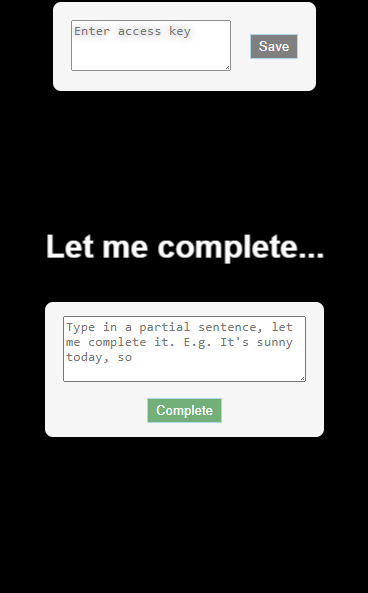

# Let Me Complete (Completer)
Let me complete is a javascript Progressive Web Application, which takes in a partial sentence and completes it with some interesting responses. It uses [OpenAI's text completion api](https://platform.openai.com/docs/guides/completion/introduction).

Completer expects API key (Access Key) of an OpenAI account to authenticate the requests.

[Click here to goto the application](https://sranmanpreet.github.io/let-me-complete/)

